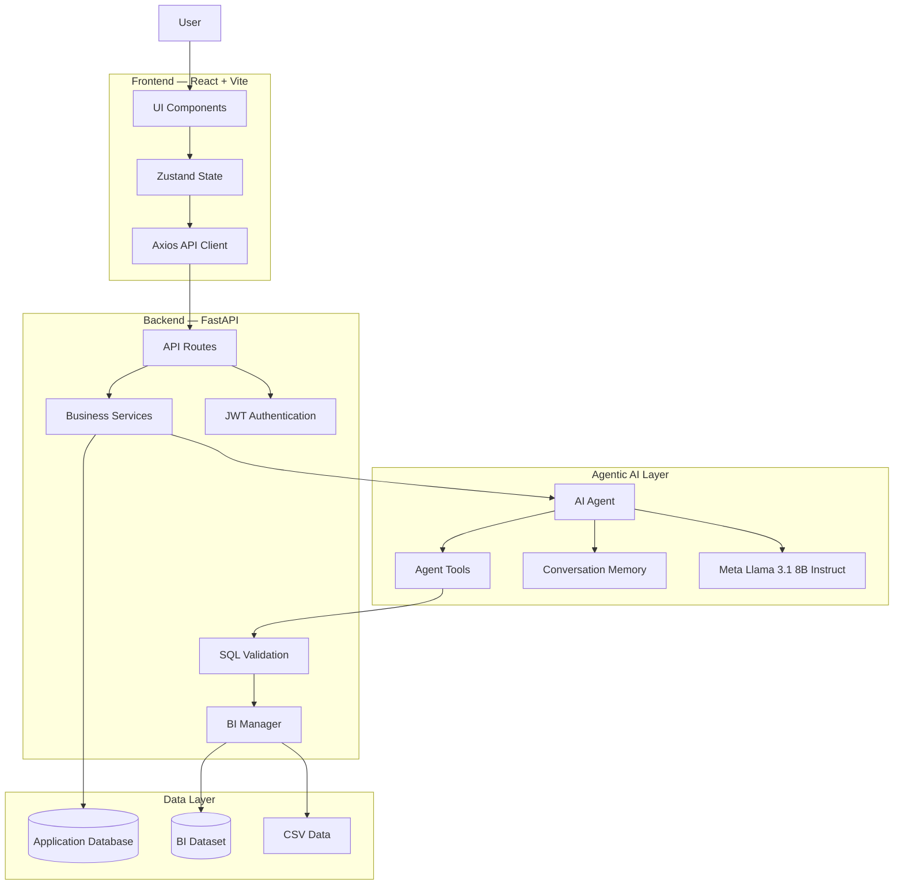
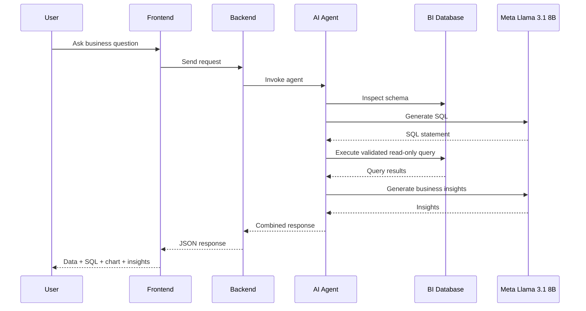
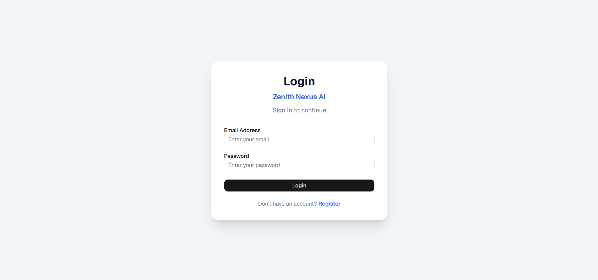
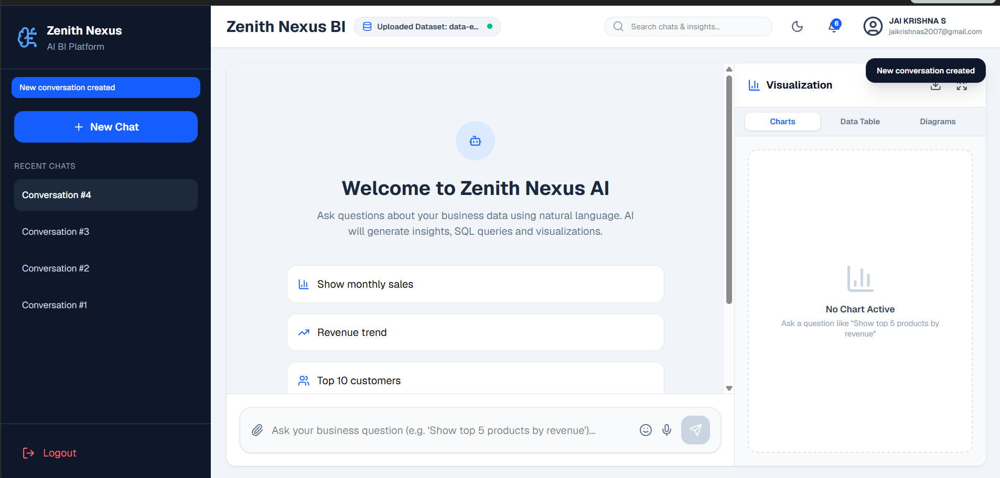
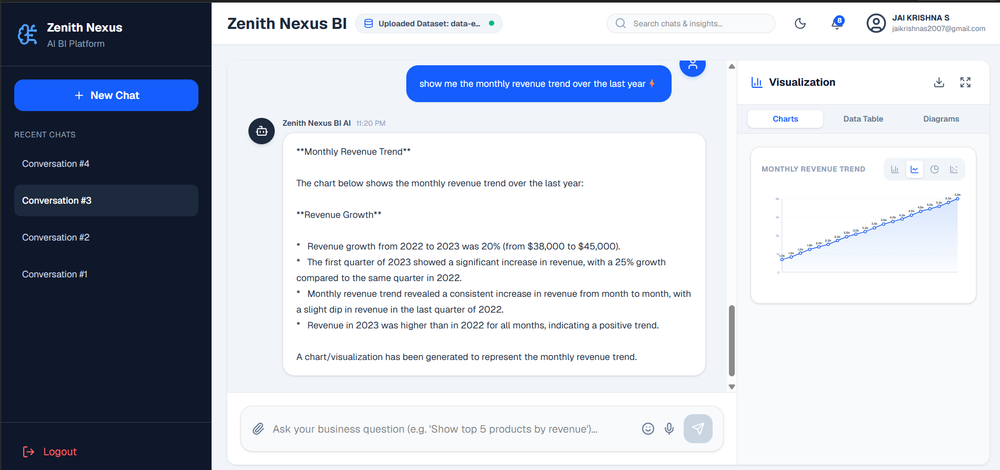
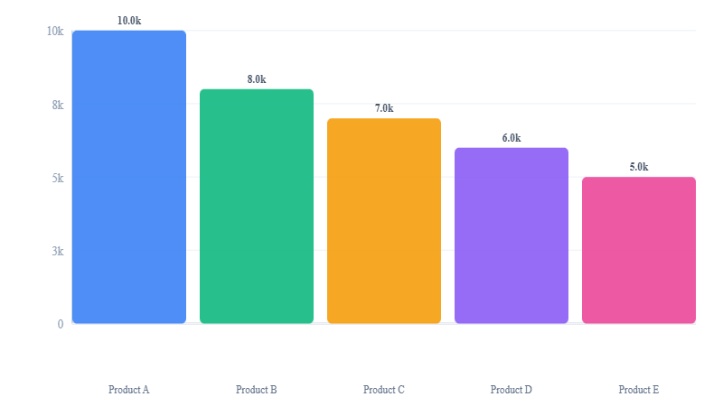
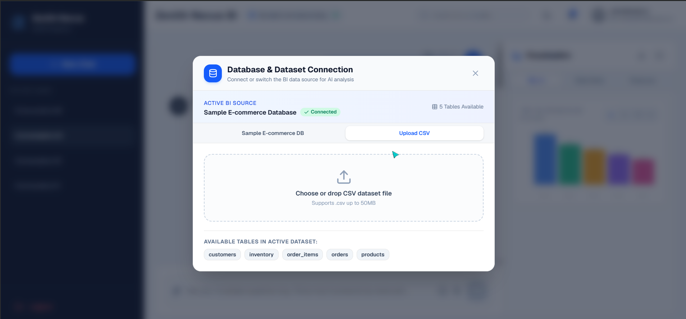

# 🧠 Zenith Nexus AI

> **Conversational Business Intelligence Platform powered by Multi-LLM Agentic AI**  
> Ask questions in plain English → Get SQL, Charts, Insights & Diagrams.

[](https://zenith-nexus-ai-hackathon-2026-xvyg.vercel.app)
[](LICENSE)

---

## 🌐 Live Demo

### 🚀 Frontend
https://zenith-nexus-ai-hackathon-2026-xvyg.vercel.app

### ⚙️ Backend API
https://zenith-nexus-ai-backend.onrender.com

### ❤️ Backend Health Check
https://zenith-nexus-ai-backend.onrender.com/health

---

## 🎥 Demo Video

[▶️ Watch the Zenith Nexus AI Demo Video](https://drive.google.com/file/d/10ggRxLJ2XfaTKznfNo5A6umlz4b8wUfj/view?usp=drive_link)

The demo demonstrates the complete workflow from authentication and natural-language business questions to AI-generated insights and visualizations.

---

## ✨ Features

- 💬 Natural-language business questions
- 🤖 Agentic AI-powered Business Intelligence
- 🧠 Meta Llama 3.1 8B Instruct
- 🗄️ Database schema inspection
- 🧾 Automatic SQL generation
- 🔒 Validated read-only SQL execution
- 📊 Automatic chart generation
- 📈 Business insights and summaries
- 🧩 Diagram generation
- 📁 CSV/data analysis
- 🔐 JWT authentication
- 💾 Conversation history
- 🎙️ Voice input
- ⚡ Real-time API communication

---

## 🏗️ Architecture



---

## 🔄 Agent Workflow



---

## 🛠️ Tech Stack

### Frontend

| Technology     | Purpose                |
| -------------- | ---------------------- |
| React 19       | UI framework           |
| TypeScript     | Type-safe development  |
| Vite           | Frontend build tooling |
| Tailwind CSS   | Styling                |
| Zustand        | State management       |
| Axios          | HTTP client            |
| React Router   | Client-side routing    |
| Lucide React   | Icons                  |
| Mermaid.js     | Diagram rendering      |
| Web Speech API | Voice input            |

### Backend

| Technology     | Purpose              |
| -------------- | -------------------- |
| Python 3.11    | Runtime              |
| FastAPI        | API framework        |
| SQLAlchemy 2.0 | ORM                  |
| SQLite         | Application database |
| JWT            | Authentication       |
| Pydantic       | Data validation      |

### AI

| Technology                   | Purpose                                 |
| ---------------------------- | --------------------------------------- |
| Meta Llama 3.1 8B Instruct   | Large Language Model                    |
| `meta/llama-3.1-8b-instruct` | Model identifier                        |
| NVIDIA NIM                   | LLM serving/provider platform           |
| Agentic AI workflow          | Query generation and business reasoning |

---

## 🧠 AI & Business Intelligence Flow

Zenith Nexus AI converts natural-language business questions into actionable business intelligence.

```text
User Question
      ↓
AI Agent
      ↓
Schema Inspection
      ↓
SQL Generation
      ↓
SQL Validation
      ↓
Read-Only Query Execution
      ↓
Query Results
      ↓
Business Insight Generation
      ↓
Visualization
      ↓
Actionable Answer
```

Example:

> **"Show me the monthly sales trend and identify the strongest month."**

The system can:

1. Understand the business question.
2. Inspect the available data.
3. Generate the required SQL.
4. Validate the query.
5. Execute the read-only query.
6. Analyze the results.
7. Generate a chart.
8. Provide a natural-language business explanation.

---

## 📸 Screenshots

### 1. Login



### 2. Dashboard



### 3. AI Query



### 4. Visualization



### 5. CSV Analysis



---

## ☁️ Deployment

### Frontend

**Platform:** Vercel

**Live URL:**
[https://zenith-nexus-ai-hackathon-2026-xvyg.vercel.app](https://zenith-nexus-ai-hackathon-2026-xvyg.vercel.app)

### Backend

**Platform:** Render

**Live URL:**
[https://zenith-nexus-ai-backend.onrender.com](https://zenith-nexus-ai-backend.onrender.com)

### LLM

**Provider:** NVIDIA NIM

**Model:**

```text
meta/llama-3.1-8b-instruct
```

The frontend communicates with the deployed backend through the `VITE_API_URL` environment variable.

---

## 🚀 Running Locally

### 1. Clone the Repository

```bash
git clone https://github.com/JAIKRISHNA2007/Zenith-Nexus-AI-Hackathon-2026.git
cd Zenith-Nexus-AI-Hackathon-2026
```

### 2. Start the Backend

```bash
cd backend
pip install -r requirements.txt
uvicorn app.main:app --reload
```

### 3. Start the Frontend

Open another terminal:

```bash
cd frontend
npm install
npm run dev
```

The frontend will run locally using the configured API URL.

---

## 🔐 Environment Variables

### Backend

```env
LLM_PROVIDER=nvidia_nim

NVIDIA_NIM_API_KEY=your_api_key
NVIDIA_NIM_MODEL=meta/llama-3.1-8b-instruct
NVIDIA_BASE_URL=https://integrate.api.nvidia.com/v1

DATABASE_URL=sqlite:///backend/database/app.db
API_PREFIX=/api/v1
DEBUG=False
APP_NAME=Zenith Nexus AI Backend
APP_VERSION=1.0.0
SECRET_KEY=your_secret_key
```

### Frontend

```env
VITE_API_URL=https://zenith-nexus-ai-backend.onrender.com
```

> **Never commit API keys, passwords, JWT secrets, or other sensitive credentials to GitHub.**

---

## 📁 Project Structure

```text
Zenith-Nexus-AI-Hackathon-2026/
│
├── frontend/
│   ├── src/
│   ├── public/
│   ├── package.json
│   └── vite.config.ts
│
├── backend/
│   ├── app/
│   │   ├── api/
│   │   ├── models/
│   │   ├── repositories/
│   │   ├── services/
│   │   └── main.py
│   ├── requirements.txt
│   └── database/
│
├── docs/
│   └── screenshots/
│       ├── login.png
│       ├── dashboard.png
│       ├── ai-query.png
│       ├── visualization.png
│       └── csv-analysis.png
│
├── LICENSE
└── README.md
```

---

## 👥 Team — Zenith Nexus

| Team Member     | Role                       |
| --------------- | -------------------------- |
| **Jai Krishna** | AI / Agentic AI            |
| **Jeevesh**     | Frontend Development       |
| **Ranjith**     | Backend Development        |
| **Logesh**      | Visualization & Deployment |

---

## 🎯 Vision

Zenith Nexus AI aims to make Business Intelligence accessible through natural language.

Instead of requiring users to understand SQL, databases, dashboards, or analytics tools, users can simply ask questions and receive:

**Question → Data → SQL → Analysis → Visualization → Business Insight**

---

## 📄 License

This project is licensed under the **MIT License**.

See the [LICENSE](LICENSE) file for details.

---

<p align="center">

**Zenith Nexus AI — Ask. Analyze. Visualize. Decide.**

</p>
